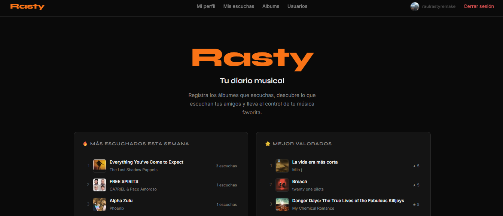
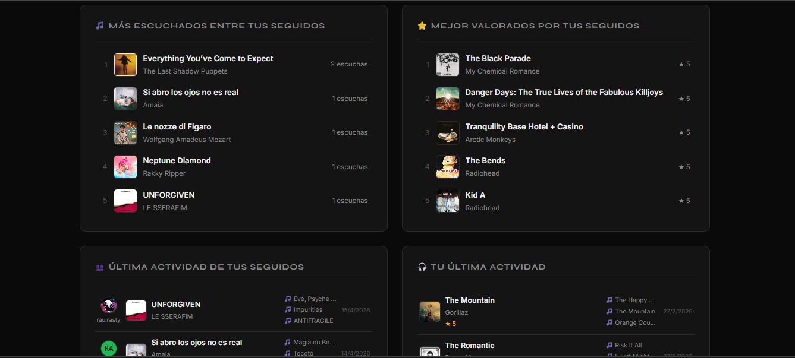
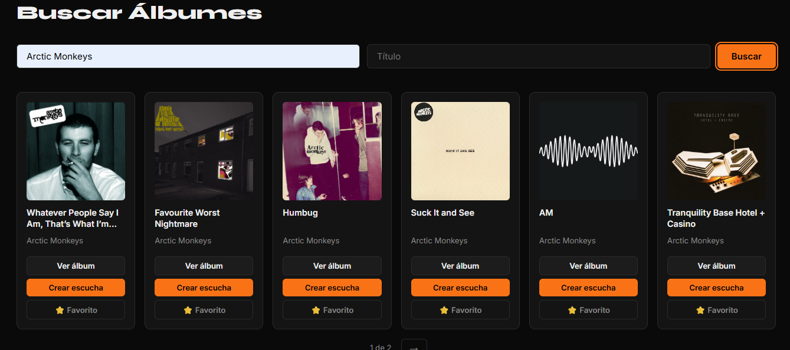
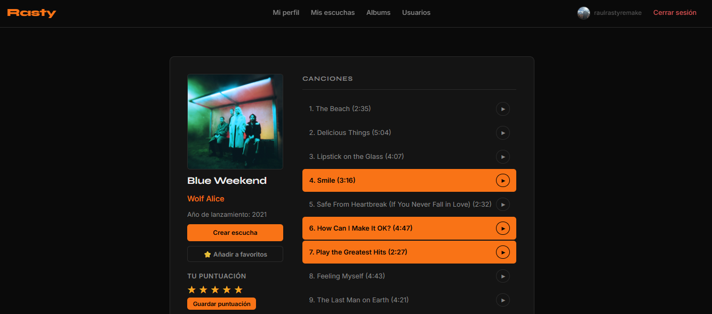
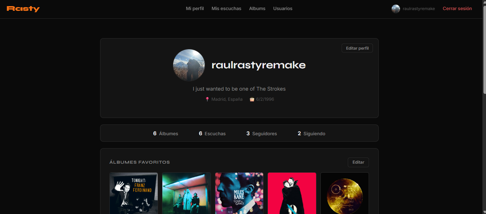
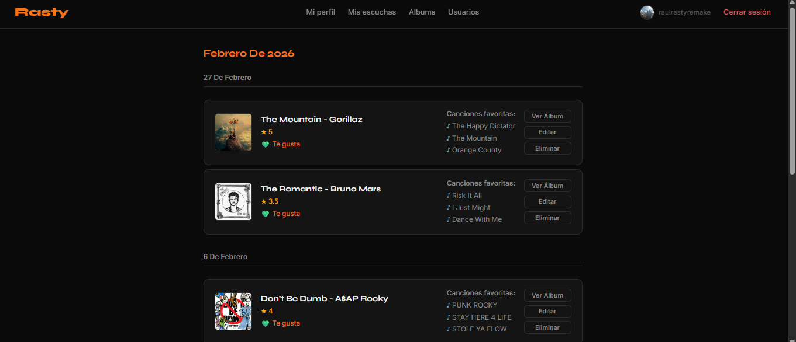

# Rasty

Rasty es una aplicación web de registro y seguimiento musical inspirada en Letterboxd. Permite a los usuarios registrar los álbumes que escuchan, valorarlos, escribir reseñas y compartir su actividad musical con otros usuarios.

**Demo en producción:** [rasty.onrender.com](https://rasty.onrender.com)

## Capturas de pantalla

## Características principales

- Registro e inicio de sesión con autenticación segura mediante Supabase Auth
- Búsqueda de álbumes por artista mediante la API de Deezer, con resultados agrupados por Álbumes y EPs
- Registro de escuchas con valoración (0.5–5 estrellas), reseña y canciones favoritas
- Previews de audio de 30 segundos mediante la Deezer API
- Perfil de usuario con estadísticas, álbumes favoritos y últimas escuchas
- Sistema social: seguir usuarios, feed de actividad y estadísticas de comunidad
- Sistema de roles: usuarios normales y administradores
- Panel de administración con estadísticas globales, gestión de usuarios, álbumes y reseñas
- Diseño responsive y accesible (WCAG)
- Page loader animado en todas las páginas

## Tecnologías

- **Frontend:** HTML5, CSS3, JavaScript vanilla
- **Backend:** Node.js + Express
- **Base de datos y autenticación:** Supabase (PostgreSQL)
- **Despliegue:** Render
- **APIs externas:** Deezer API, UI Avatars

## Requisitos previos

- Node.js v18 o superior
- npm v9 o superior
- Cuenta en Supabase (plan gratuito suficiente)
- Conexión a internet (para las APIs externas)

## Instalación en local

### 1. Clonar el repositorio

    git clone https://github.com/raulrasty/Rasty.git
    cd rasty

### 2. Instalar dependencias

    npm install

### 3. Configurar variables de entorno

Crea un archivo .env en la raíz del proyecto:

    SUPABASE_URL=https://tu-proyecto.supabase.co
    SUPABASE_KEY=tu-anon-key
    SUPABASE_SERVICE_ROLE_KEY=tu-service-role-key
    JWT_SECRET=tu-clave-secreta
    PORT=3000

Nunca subas el archivo .env al repositorio. Está incluido en .gitignore.

### 4. Crear las tablas en Supabase

En el panel de Supabase ve a SQL Editor y ejecuta el script incluido en database.sql.

### 5. Arrancar el servidor

    npm start

La aplicación estará disponible en http://localhost:3000

Para desarrollo con recarga automática usa npm run dev

## Despliegue en Render

1. Conecta el repositorio de GitHub en Render
2. Crea un nuevo Web Service — Render detecta Node.js automáticamente y ejecuta npm start
3. Selecciona la instancia gratuita (Free)
4. Añade las variables de entorno en la pestaña Environment
5. Render genera un dominio público automáticamente
6. Cada push a main desencadena un redespliegue automático

## Estructura del proyecto

    rasty/
    ├── config/
    │   └── supabaseClient.js
    ├── controllers/
    │   └── adminController.js
    ├── middleware/
    │   ├── requireAuth.js
    │   └── requireAdmin.js
    ├── routes/
    │   └── adminRoutes.js
    ├── services/
    │   └── adminService.js
    ├── public/
    │   ├── css/
    │   ├── js/
    │   │   └── config.js
    │   └── *.html
    ├── components/
    │   └── header.html
    ├── img/
    ├── database.sql
    ├── .env
    ├── .gitignore
    ├── package.json
    └── server.js

## Rutas de la API

| Método | Ruta | Descripción |
|--------|------|-------------|
| POST | /users/register | Registro de usuario |
| POST | /users/login | Inicio de sesión |
| GET | /users/search | Buscar usuarios |
| GET | /users/:id | Obtener perfil |
| PUT | /users/:id | Actualizar perfil |
| DELETE | /users/me | Eliminar cuenta propia |
| DELETE | /users/:id | Eliminar cuenta (solo admin) |
| GET | /albums | Obtener todos los álbumes |
| GET | /albums/search-mb | Buscar álbumes en Deezer |
| GET | /albums/preview/:trackId | Obtener preview de canción de Deezer |
| GET | /albumInfo/:id | Obtener info de un álbum |
| GET | /songs/:album_id | Obtener canciones de un álbum |
| GET | /listens/:user_id | Escuchas de un usuario |
| GET | /listens/paginated/:user_id | Escuchas paginadas |
| GET | /listens/albums/:user_id | Álbumes únicos de un usuario |
| POST | /listens | Crear escucha |
| PUT | /listens/:id | Editar escucha |
| DELETE | /listens/:id | Eliminar escucha |
| POST | /follows/:userId | Seguir usuario |
| DELETE | /follows/:userId | Dejar de seguir |
| GET | /follows/is-following/:userId | Comprobar si sigues a un usuario |
| GET | /follows/followers/:userId | Obtener seguidores |
| GET | /follows/following/:userId | Obtener seguidos |
| POST | /album-ratings/:albumId | Guardar valoración |
| GET | /album-ratings/:albumId/my-rating | Obtener valoración propia |
| GET | /album-ratings/:albumId/average | Media de valoraciones |
| GET | /album-ratings/:albumId/distribution | Distribución de valoraciones |
| GET | /album-ratings/:albumId/following | Valoraciones de seguidos |
| GET | /favorite-albums/:userId | Álbumes favoritos de un usuario |
| POST | /favorite-albums | Guardar álbumes favoritos |
| POST | /favorite-songs/listen/:listenId | Guardar canciones favoritas de escucha |
| GET | /favorite-songs/listen/:listenId | Obtener canciones favoritas de escucha |
| POST | /favorite-songs/album/:albumId | Guardar canciones favoritas de álbum |
| GET | /favorite-songs/album/:albumId | Obtener canciones favoritas de álbum |
| GET | /favorite-songs/album/:albumId/top | Top canciones favoritas comunidad |
| GET | /favorite-songs/album/:albumId/following | Top canciones favoritas seguidos |
| GET | /user-ratings/:userId | Distribución de ratings de un usuario |
| GET | /community/top-week | Álbumes más escuchados esta semana |
| GET | /community/top-rated | Álbumes mejor valorados |
| GET | /community/following-activity | Actividad de seguidos |
| GET | /community/following-top-week | Top semanal de seguidos |
| GET | /community/following-top-rated | Mejor valorados por seguidos |
| GET | /community/own-activity | Actividad propia |
| GET | /admin/stats | Estadísticas globales (solo admin) |
| GET | /admin/users | Listado de usuarios paginado (solo admin) |
| PUT | /admin/users/:id/role | Cambiar rol de usuario (solo admin) |
| DELETE | /admin/users/:id | Eliminar usuario (solo admin) |
| GET | /admin/albums | Listado de álbumes paginado (solo admin) |
| DELETE | /admin/albums/:id | Eliminar álbum (solo admin) |
| GET | /admin/reviews | Listado de reseñas (solo admin) |
| DELETE | /admin/reviews/:id | Eliminar reseña (solo admin) |

## Variables de entorno

|          Variable         |     Descripción                         |
|---------------------------|-----------------------------------------|
|         SUPABASE_URL      | URL de tu proyecto Supabase             |
|         SUPABASE_KEY      | Anon key de Supabase                    |
| SUPABASE_SERVICE_ROLE_KEY | Service role key (bypasea RLS)          |
|        JWT_SECRET         | Clave secreta para tokens JWT           |
|            PORT           | Puerto del servidor (por defecto 3000)  |

## Sistema de roles

Rasty tiene dos roles: user (por defecto) y admin. Para dar permisos de administrador ejecuta en el SQL Editor de Supabase:

    UPDATE users SET role = 'admin' WHERE username = 'tu-username';

Los usuarios admin tienen acceso al panel de administración en /adminPanel.html, visible en el header solo para admins.

## Autor

Raúl Álvarez Tejero — Proyecto Final de Ciclo DAW 2026